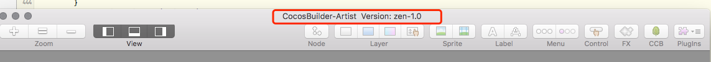
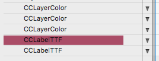
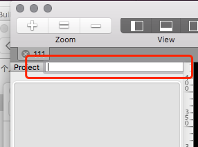
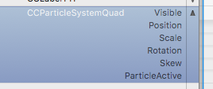
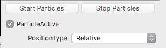

#2017 4 7

1. 现在cocosbuilder有两个版本：程序版和美术版。美术使用的版本是带有-Artist后缀的。

2. cocosbuilder的版本信息可以在程序的标题上面看到

	

3. 如果一个node绑定了变量，那么它会变成红色

	

4. 美术版中这些绑定了变量的node和它们的父节点不能被删除，绑定信息也不会被修改

5. 增加了一个资源过滤器，可以用来快速查找资源

	

6. 现在可以一次拖拽多个图片到ccb里面

7. 现在可以复制粘贴和拖拽多个节点

8. 粒子多了一个可以加关键帧的属性ParticleActive。
	
	

	对于无限时间的粒子，它可以控制例子的播放和停止。
	
	对于有限时间的粒子，它和之前在callback里面加的p命令是一致的。p依然有效，但是建议使用这个新的属性。不要同时使用p和这个属性
	
	
	
	**在右侧出现这个ParticleActive没有实际作用，不要改**
	
	右侧新加了PositionType属性，可以改变粒子的移动方式，可以调试粒子的跟随。
	
